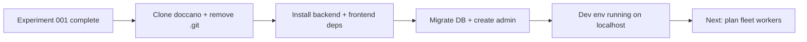

## What
- Cloned doccano into `async-jar/doccano/`, removed `.git` to make it part of this repo
- Set up backend Python environment with uv + poetry on Python 3.10
- Ran Django migrations, created roles and admin superuser
- Installed frontend deps with yarn
- Both servers running in tmux session `doccano` (two panes)
- Verified login works at `localhost:3000` with admin/password
- Cleaned up 3 stale tmux sessions (doccano-research, issue-verification, repo-research)

## Exact Steps to Reproduce

### 1. Clone doccano and strip .git
```bash
cd /home/sagar/async-jar
git clone https://github.com/doccano/doccano.git
rm -rf doccano/.git
```

### 2. Backend setup (Python 3.10 + uv)
```bash
cd /home/sagar/async-jar/doccano/backend

# Create venv with Python 3.10 (not 3.14 — scipy has no binary wheels for 3.14)
uv venv --python 3.10 .venv

# Install poetry into the venv
uv pip install --python .venv/bin/python poetry

# Add export plugin and export requirements
.venv/bin/poetry self add poetry-plugin-export
.venv/bin/poetry export --without-hashes -f requirements.txt 2>/dev/null > /tmp/doccano-reqs.txt

# Install all deps (allow source builds — some pure-python packages lack wheels)
uv pip install --python .venv/bin/python -r /tmp/doccano-reqs.txt
```

**Gotcha:** If you use `uv venv` without `--python 3.10`, it picks Python 3.14 which can't build scipy (no C compiler in sandbox). Always pin 3.10.

### 3. Django setup
```bash
cd /home/sagar/async-jar/doccano/backend
.venv/bin/python manage.py migrate
.venv/bin/python manage.py create_roles
.venv/bin/python manage.py create_admin --noinput --username admin --email admin@example.com --password password
```

### 4. Frontend setup
```bash
cd /home/sagar/async-jar/doccano/frontend
npx yarn install
```

### 5. Disable Nuxt telemetry prompt (blocks startup with interactive Y/n)
```bash
cd /home/sagar/async-jar/doccano/frontend
npx nuxt telemetry disable
```

### 6. Bind frontend to localhost (not 0.0.0.0)
Edit `doccano/frontend/nuxt.config.js` — change:
```js
server: {
    host: 'localhost'
},
```
This is needed for VS Code port forwarding to detect the port.

### 7. Launch in tmux
```bash
# Create session with backend in top pane
tmux new-session -d -s doccano -n dev -c /home/sagar/async-jar/doccano/backend
tmux send-keys -t doccano:dev '.venv/bin/python manage.py runserver localhost:8000' Enter

# Split for frontend in bottom pane
tmux split-window -v -t doccano:dev -c /home/sagar/async-jar/doccano/frontend
tmux send-keys -t doccano:dev.1 'NUXT_TELEMETRY_DISABLED=1 npx yarn dev' Enter
```

**Gotcha:** First `yarn dev` run takes ~2 minutes — Nuxt compiles everything through babel-loader (1300+ modules). Subsequent starts with warm cache are faster.

### 8. Access from local machine (Azure VM)
VS Code port forwarding didn't work reliably. Use SSH tunnel instead:
```bash
# From local machine
ssh -L 3000:localhost:3000 -L 8000:localhost:8000 quickcall-vm
```
Then open `http://localhost:3000` in browser. Login: **admin** / **password**.

## Key Takeaways
- Python 3.10 is required — 3.14 lacks binary wheels for scipy, and the sandbox blocks C compilers
- Nuxt telemetry prompt blocks startup — must disable beforehand or set `NUXT_TELEMETRY_DISABLED=1`
- VS Code Remote-SSH port forwarding unreliable on this VM — manual SSH tunnel (`ssh -L`) is the fallback
- `django-polymorphic==4.9.0` is yanked (base_manager_name bug) — works for now but worth noting
- The staticfiles warning (`client/dist/static` doesn't exist) is harmless in dev mode

## Issues
- VS Code port forwarding doesn't work on this VM despite correct Remote-SSH config and settings tweaks (`enableDynamicForwarding: false`, `useExecServer: false`, `useLocalServer: false`). Manual SSH tunnel required.
- `django-polymorphic` yanked version warning — not blocking but may cause issues later

## Decisions
- **Python 3.10 over 3.14** — forced by scipy binary wheel availability + sandbox compiler restrictions
- **uv + poetry export** over pure poetry install — poetry install tried to build scipy from source and failed; exporting to requirements.txt and using uv pip install with pre-built wheels worked
- **SSH tunnel over VS Code forwarding** — pragmatic choice after forwarding failed repeatedly
- **localhost binding** over 0.0.0.0 — needed for port forwarding detection

## Current State
- Tmux sessions: `0` (claude code), `2` (skills-test), `doccano` (dev servers)
- Backend: `localhost:8000` — Django runserver, SQLite, admin user created
- Frontend: `localhost:3000` — Nuxt dev with HMR, proxies `/v1/` to backend
- DB: SQLite at `doccano/backend/db.sqlite3` — migrated, roles + admin created
- Doccano source: `/home/sagar/async-jar/doccano/` (no .git)

## Next
Continue with:

### Step 3: Plan fleet workers
- Create detailed worker prompts for: `ml-service`, `backend`, `frontend`, `infra`, `synthesizer`
- Reference plan-02 from experiment 001: `docs/experiments/001-research-repos/plans/02-build-fleet-task-bundle.md`
- Reference research fleet output: `docs/experiments/001-research-repos/fleet-doccano-research/workers/*/output/`
- Each prompt must include TDD approach, exact file paths, test commands

### Step 4: Iterate until one-shot
- Launch fleet, check outputs, fix prompts, rerun until clean
