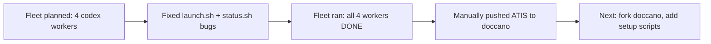

## What

### Fleet produced (4/4 workers DONE, $1.72 total)
- **dataset-scout** ($0.53) — Ranked 3 datasets. Top pick: ATIS (intent + NER with char offsets). Also found Smart Home joint intent/slot, SemEval-2014 ABSA.
- **setup-script** ($0.59) — Generated `/tmp/setup-demo.py` (full doccano REST API automation: login, project creation, label types, upload, auto-labeling config) and `/tmp/demo-dataset.jsonl` (20 hand-written NER+sentiment examples as fallback).
- **reviewer** ($0.37) — Verdict C: rejected ATIS for the fleet's hardcoded sentiment contract (POSITIVE/NEGATIVE/NEUTRAL). Correctly identified ontology mismatch but over-constrained — the contract was arbitrary for a demo.
- **transformer** ($0.23) — Skipped real transform per reviewer's verdict.

### What we did manually after fleet
- Overrode reviewer's decision — ATIS is fine for a demo, sentiment labels don't matter.
- Downloaded ATIS train.json (4978 examples), transformed 100 to doccano JSONL (`/tmp/atis-demo.jsonl`).
- Created doccano project 2 ("ATIS Flight Demo") with 11 intent category labels and 40 entity span labels using native ATIS taxonomy.
- Started Celery worker (was down), uploaded JSONL via filepond two-step API. 100 examples loaded.

### Files created by fleet + manual work
| File | What | Where |
|------|------|-------|
| `/tmp/setup-demo.py` | Doccano setup script (REST API) | Fleet: setup-script worker |
| `/tmp/demo-dataset.jsonl` | 20-row fallback dataset (NER+sentiment) | Fleet: setup-script worker |
| `/tmp/atis-demo.jsonl` | 100-row ATIS dataset (intent+slot NER) | Manual transform |
| Fleet worker outputs | findings.md, verdict.md | `docs/experiments/002-doccano-build/fleet-demo-data/workers/*/output/` |

## Key Takeaways

- The fleet's reviewer was too rigid — it blocked ATIS because the prompt contract specified sentiment labels. For demo purposes, native ATIS labels are better than forcing a sentiment mapping.
- Doccano upload API is two-step: POST file to `/v1/fp/process/` (filepond), then POST uploadIds to `/v1/projects/{id}/upload`. The old single-step upload returns 500 with `KeyError: 'uploadIds'`.
- `resourcetype` field is required for project creation (e.g. `IntentDetectionAndSlotFillingProject`). Not documented in the fleet's setup script.
- Celery must be running for imports. Start with: `cd doccano/backend && .venv/bin/celery -A config worker -l info --concurrency=1`

## Issues

- Fleet's setup script (`/tmp/setup-demo.py`) uses the old single-step upload API — will fail on current doccano. Needs updating to filepond two-step.
- Fleet's setup script hardcodes sentiment labels (POSITIVE/NEGATIVE/NEUTRAL) and NER labels (PER/ORG/LOC/DATE/MISC) — needs to be parameterized or updated for ATIS.
- Celery process was started ad-hoc (`&` background) — not persistent across restarts.

## Decisions

| Decision | Why |
|----------|-----|
| Use ATIS with native labels | Demo doesn't need sentiment. Intent+slot is more interesting and authentic. |
| Override fleet reviewer | Reviewer was correct about contract mismatch but wrong about what the demo needs. |
| 100 examples, not full 4978 | Demo-sized slice with intent diversity. |

## Next

### Fork doccano and set up clean repo
1. Fork `doccano/doccano` to `sagarsrc/doccano-fork` on GitHub
2. Clone to `~/doccano-fork`
3. Copy generated files into the fork:
   - `/tmp/setup-demo.py` → needs updating (filepond API, ATIS labels, resourcetype field)
   - `/tmp/atis-demo.jsonl` → demo dataset
4. Fix setup script issues:
   - Two-step upload (filepond + uploadIds)
   - Add `resourcetype` to project creation
   - Parameterize labels or use ATIS defaults
5. Test end-to-end in a fresh doccano instance from the fork
6. Keep `/home/sagar/async-jar/doccano/` untouched (current dev instance)

### Commands for next agent
```bash
# Fork (via gh CLI)
gh repo fork doccano/doccano --org sagarsrc --fork-name doccano-fork --clone=false
gh repo clone sagarsrc/doccano-fork ~/doccano-fork

# Copy artifacts
cp /tmp/setup-demo.py ~/doccano-fork/tools/
cp /tmp/atis-demo.jsonl ~/doccano-fork/tools/
```
