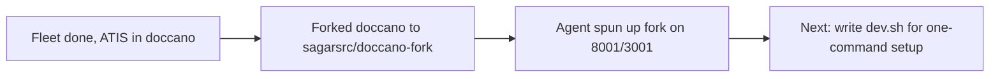

## What

- Forked `doccano/doccano` → `sagarsrc/doccano-fork` on GitHub
- Cloned to `~/doccano-fork`
- Copied fleet artifacts (`setup-demo.py`, `atis-demo.jsonl`) into `~/doccano-fork/tools/`
- Agent autonomously set up the full dev env:
  - Backend: Python 3.10 venv, poetry install, migrations, admin user (`admin`/`password`)
  - Frontend: yarn install, Nuxt dev server proxying to backend on 8001
  - Celery: worker running against fork's own sqlite DB
  - All in tmux session `doccano-fork` (windows: backend, celery, frontend)
- Agent fixed `setup-demo.py`: filepond two-step upload, `resourcetype` field, ATIS native labels, CSRF handling, celery task polling
- 100 ATIS examples loaded into fork's project id=3

## Key Takeaways

- **Celery** is doccano's background task queue — needed for dataset imports. Without it, uploads queue but never process. Must be running before any data load.
- **Everything was autonomous** — no manual UI clicks. Fleet generated scripts, agent set up the fork. The entire flow from zero to loaded doccano is scriptable.
- Two doccano instances now running side by side: original (8000/3000) and fork (8001/3001), separate databases.

## Issues

- No single `dev.sh` yet — setup was done step-by-step by the agent. Need to consolidate into one script.
- The fork's `setup-demo.py` was updated by the agent in-place — need to verify the exact state of that file.
- Frontend port 3001 binds to 0.0.0.0 (not localhost) — fine for dev, would need tightening for anything shared.

## Decisions

| Decision | Why |
|----------|-----|
| Fork on GitHub, not local-only | Enables pushing changes, PRs, sharing |
| Separate ports (8001/3001) | Keep existing dev instance alive for reference |
| tmux session per instance | Easy to attach/kill independently |

## Next

### Write `dev.sh` — single command, zero-to-running
One script in `~/doccano-fork/tools/dev.sh` that does everything:
1. Create venv + install backend deps (poetry/pip)
2. Run migrations + create roles + create admin
3. Start backend (8001), celery, frontend (3001) in tmux `doccano-fork`
4. Wait for health checks to pass
5. Run `setup-demo.py` to create project + load ATIS data
6. Print "ready" with URLs

### Current running services
```bash
# Check status
tmux list-windows -t doccano-fork -F '#W'

# Attach
tmux attach -t doccano-fork

# Kill
tmux kill-session -t doccano-fork
```

### Key paths
| What | Path |
|------|------|
| Fork repo | `~/doccano-fork` |
| Backend venv | `~/doccano-fork/backend/.venv` |
| Setup script | `~/doccano-fork/tools/setup-demo.py` |
| ATIS dataset | `~/doccano-fork/tools/atis-demo.jsonl` |
| Fork DB | `~/doccano-fork/backend/db.sqlite3` |
| Original doccano | `~/async-jar/doccano/` (DO NOT TOUCH) |
