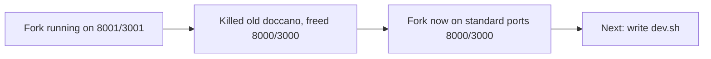

## What

- Killed old doccano instance (was on 8000/3000), removed `~/async-jar/doccano/` directory
- Killed stale celery worker from old instance (PID 2325646)
- Restarted fork on standard ports: backend 8000, frontend 3000, celery worker
- Committed and pushed all experiment 002 artifacts to async-jar (46 files)
- Forked repo `sagarsrc/doccano-fork` has setup-demo.py and atis-demo.jsonl in tools/

## Key Takeaways

- Only one doccano instance now — the fork at `~/doccano-fork` on standard ports
- 100 ATIS examples already loaded in the fork's DB (project id=3 from earlier agent run on 8001)
- Everything autonomous so far — no manual UI interaction needed

## Issues

- None currently. All services healthy.

## Decisions

| Decision | Why |
|----------|-----|
| Standard ports 8000/3000 | No reason to use non-standard now that old instance is gone |
| Removed ~/async-jar/doccano/ | Fork is the canonical instance now, no need for two |

## Next

### Write `dev.sh` — one command to rule them all
Script at `~/doccano-fork/tools/dev.sh` that takes a fresh clone to running+loaded:
1. Create venv, install deps
2. Migrate, create roles, create admin
3. Start backend (8000), celery, frontend (3000) in tmux `doccano-fork`
4. Health check loop
5. Run setup-demo.py → ATIS project loaded
6. Print URLs

### Running services
```bash
tmux attach -t doccano-fork   # 3 windows: backend, celery, frontend
```

### Port forwarding (from local machine)
```bash
ssh -L 8000:localhost:8000 -L 3000:localhost:3000 <vm-host>
```

### Key paths
| What | Path |
|------|------|
| Fork repo | `~/doccano-fork` |
| Setup script | `~/doccano-fork/tools/setup-demo.py` |
| ATIS data | `~/doccano-fork/tools/atis-demo.jsonl` |
| DB | `~/doccano-fork/backend/db.sqlite3` |
