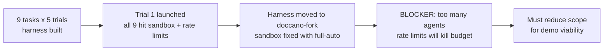

## What
- Built full trial harness: 9 parallel iterative fleets, 5 trials pre-generated (135 files)
- Moved all docs/fleet infra into ~/doccano-fork/ (proper /doc experiment structure)
- Trial 1 launched but all 9 builders failed — codex sandbox blocked access to worktrees
- Fixed sandbox with `full-auto` + `depends_on: ["builder"]` for reviewer ordering
- Harness infrastructure is solid. The problem is scale, not design.

## Key Takeaways
- **9 concurrent codex agents + 9 concurrent opus reviewers = 18 agents hitting APIs simultaneously.** This will burn through rate limits instantly, especially on codex provider.
- **Trial 1 cost ~$17 across 9 fleets in just iteration 1** (mostly sandbox failures, so real work would cost more). At 10 iterations x 9 tasks = 90 agent runs per trial. 5 trials = 450 agent runs. Budget ceiling is $1800.
- **The doccano codebase is large** — backend (Django, 18 apps), frontend (Nuxt/Vue, 20+ components). Cold-start agents spend significant budget just understanding the repo before writing a single line.
- **Most tasks touch overlapping files** (backend/auto_labeling/, frontend/components/) — the 9-way merge will be complex and fragile.

## Issues
1. **Rate limits**: 18 concurrent API calls will trigger provider rate limits quickly. codex and claude both have per-minute token limits.
2. **Budget burn on discovery**: Each cold-start agent re-reads the same large codebase. 9 agents x 10 iterations = 90 cold reads of the same repo.
3. **Merge complexity**: Tasks 2,3,5,6,7 all touch `backend/auto_labeling/views.py`. Tasks 4,5,6,7 all touch frontend components. The opus merger faces a 5-way merge on core files.
4. **Demo overkill**: For a demo of the iterative-fleet skill, we don't need all 9 features. We need enough to prove the harness works.

## Decisions
- **MUST reduce scope before next launch.** Options:
  1. **Reduce to 2-3 tasks** that don't overlap (e.g., Task 1 ML service + Task 8 setup script + Task 9 docker-compose) — these touch completely independent files
  2. **Reduce to 1 trial** instead of 5 — prove the loop works once, then decide if more trials add value
  3. **Sequential not parallel** — run 2-3 fleets at a time to avoid rate limits, at the cost of wall-clock time
  4. **Slim the repo** — strip doccano down to just the modules needed for the demo tasks, so cold-start agents have less to read

## Next
1. **Pick 2-3 non-overlapping tasks** from the bundle that demonstrate the harness end-to-end:
   - Task 1 (ML service) — standalone, new directory, no overlap
   - Task 8 (setup script) — standalone, new file, no overlap  
   - Task 9 (docker-compose) — standalone, new file, no overlap
   - OR Task 2 (span dedup) if we want a "modify existing code" example
2. **Regenerate fleet files** for only the selected tasks (update generate-trials.py or generate manually)
3. **Run trial 1 with reduced scope** — 2-3 fleets max concurrent
4. **If successful**, evaluate whether to expand scope or call the demo done

Key files:
- Generator: `~/doccano-fork/docs/experiments/002-doccano-build/generate-trials.py`
- Orchestrator prompt: `~/doccano-fork/docs/experiments/002-doccano-build/orchestrator-prompt.md`
- Plan: `~/doccano-fork/docs/experiments/002-doccano-build/plans/03-trial-harness-v3.md`
- Fleet dirs: `~/doccano-fork/docs/experiments/002-doccano-build/trials/trial{1-5}/fleet-*/`
