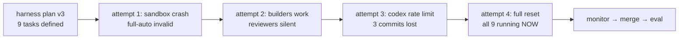

## What

Building a doccano auto-labeling feature set via 9 parallel iterative fleets. Each fleet has a gpt-5.4 builder (codex) and a gpt-5.4 reviewer (codex) running in a DAG (builder must finish before reviewer spawns). The harness plan is at `docs/experiments/002-doccano-build/plans/03-trial-harness-v3.md`, task descriptions at `plans/02-build-fleet-task-bundle.md`.

### The 9 tasks
1. **ml-service** — standalone FastAPI NER + sentiment service
2. **span-dedup** — fix #2370, dedup spans in auto-labeling pipeline
3. **timeout** — timeout + error handling for auto-labeling
4. **toolbar-btn** — auto-label button on annotation toolbar
5. **health-indicator** — ML service health dot on config list
6. **bulk-autolabel** — bulk auto-label button on dataset page
7. **result-toast** — toast/feedback after auto-labeling
8. **setup-script** — demo setup script (project + data + configs)
9. **dev-compose** — docker-compose.dev.yml with ML service

### What happened across 4 launch attempts

**Attempt 1** — All 9 builders crashed instantly. `fleet.json` had `"sandbox": "full-auto"` which is not a valid codex `--sandbox` value (valid: `read-only`, `workspace-write`, `danger-full-access`). `full-auto` is a CLI convenience flag, not a sandbox mode. Reviewers fired on empty worktrees, rejected everything. Finding 08 in experiment 004-fleet-umbrella.

**Attempt 2** — Fixed builder sandbox to `danger-full-access`. Builders ran correctly — 3 fleets (ml-service, span-dedup, timeout) committed real code. But reviewers had `workspace-write` sandbox with `-C` pointing to fleet root, so they couldn't read the worktree (outside fleet root). Reviewers exited cleanly but wrote zero output. Orchestrator fallback synthesized `verdict: iterate` endlessly.

**Attempt 3** — Fixed reviewer sandbox to `danger-full-access` too. But codex usage limit had been hit from attempt 2's 9 parallel builders. All builders got `"You've hit your usage limit"` error. Killed immediately.

**Attempt 4 (current)** — Full reset: deleted all worktrees/branches, cleaned all fleet state, recreated from master. User updated codex credits. All 9 launched successfully — builders producing 50-67KB session output within seconds, zero errors, zero premature sentinels. DAG ordering confirmed working (orchestrator polling "Waiting for workers: builder").

## Key Takeaways

- `codex --sandbox` only accepts 3 values: `read-only`, `workspace-write`, `danger-full-access`. The `--full-auto` convenience flag is NOT a sandbox mode.
- Both builder and reviewer need `danger-full-access` when fleet root and code worktree are in different directory trees. `workspace-write` silently restricts access — workers don't crash, they just produce no output.
- The iterative-fleet DAG layer system (from finding 06/07 fixes) works correctly: builder runs → `.done` sentinel → orchestrator spawns reviewer. No race conditions observed in attempts 2-4.
- 9 parallel codex builders burn through credits fast. Previous run consumed the full quota in ~10 minutes.

## Issues

- **3 prior launch failures** before getting a clean run — all caused by sandbox misconfiguration cascading through the fleet
- **Codex rate limiting** — 9 parallel gpt-5.4 builders are expensive. No per-worker cost tracking since codex session.jsonl doesn't report costs the same way claude does. The $40/fleet cost cap in fleet.json may not be enforceable.
- **Reviewer prompt says to read worktree code** but `-C` flag points to fleet root — workers must navigate to the worktree path in the prompt. This works with `danger-full-access` but is fragile.

## Decisions

- **gpt-5.4 for everything** — user chose to run both builder and reviewer on codex/gpt-5.4 instead of the original plan's opus reviewer. Cheaper per iteration, but no cost visibility.
- **`danger-full-access` for both workers** — necessary because fleet root (`docs/experiments/.../fleet-X/`) and code worktree (`worktrees/trial1-X/`) are separate directory trees. No way around this with the current fleet layout.
- **Full reset on attempt 4** — discarded 3 commits from attempt 2 (ml-service, span-dedup, timeout) to get a clean slate. Worth it for a definitive test.

## Files

- Fleet configs: `docs/experiments/002-doccano-build/trials/trial1/fleet-{task}/fleet.json` (9 files)
- Task bundle: `docs/experiments/002-doccano-build/plans/02-build-fleet-task-bundle.md`
- Harness plan: `docs/experiments/002-doccano-build/plans/03-trial-harness-v3.md`
- Builder prompts: `trials/trial1/fleet-{task}/workers/builder/prompt.md`
- Reviewer prompts: `trials/trial1/fleet-{task}/workers/reviewer/prompt.md`
- Worktrees: `/home/sagar/doccano-fork/worktrees/trial1-{task}/` (9 worktrees)
- Sandbox finding: `/home/sagar/skills-test/docs/experiments/004-fleet-umbrella/findings/08-codex-sandbox-invalid-value-crash.md`

## Next

1. **Monitor all 9 fleets** — check status periodically, watch for builders committing code and reviewers writing real reviews
2. **First milestone**: all 9 builders complete iter 1 with commits + attempt docs, all 9 reviewers write real verdict files
3. **Watch for**: reviewer not writing verdict (sandbox or path issue), orchestrator stuck polling, codex rate limits
4. **When all 9 complete** (LGTM or max iterations): read completion reports, run opus merger to combine all 9 branches into `trial1`, run full test suite
5. **Commands to use**:
   - Status: `bash /home/sagar/skills-test/skills/fleet/iterative-fleet/scripts/status.sh /home/sagar/doccano-fork/docs/experiments/002-doccano-build/trials/trial1/fleet-{task}`
   - Kill all: loop `kill.sh ... all` over all 9
   - Attach: `tmux attach -t trial1-{task}`
