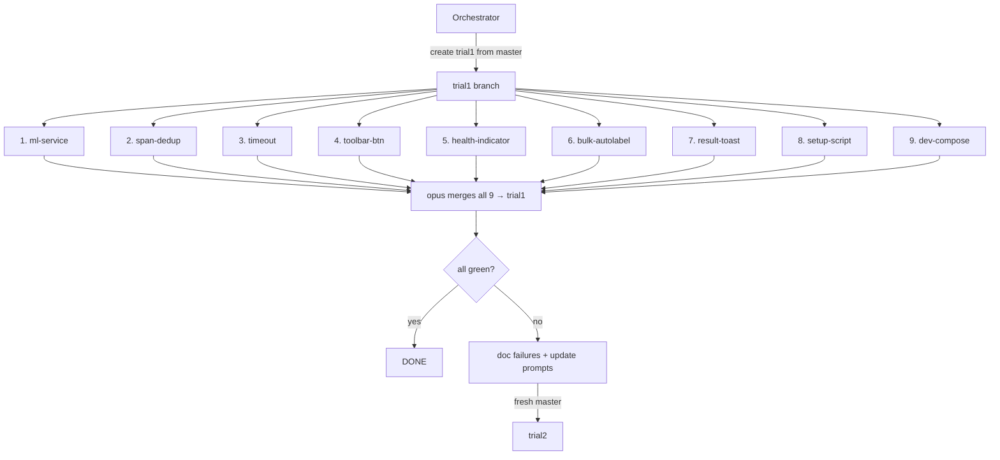
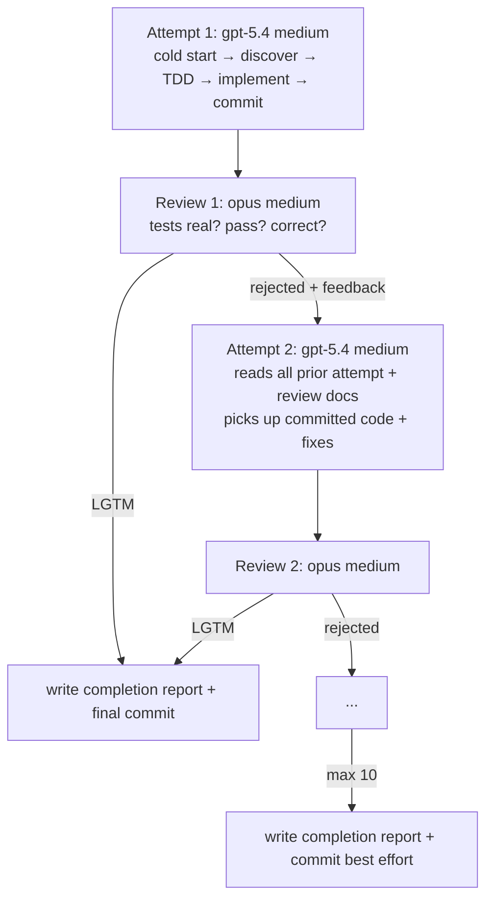

## Principle

We're building a **harness**, not an execution plan. Agents start cold — they discover, plan, implement, iterate. We define: task grouping, iteration protocol, prompt contracts, documentation hooks. We don't prescribe implementation.

## Task Reference

Full task descriptions are in:
**`~/doccano-fork/docs/plans/02-build-fleet-task-bundle.md`**

Each worker prompt must include the FULL task description from that file — not a summary. Copy the entire task section verbatim.

9 tasks. **One task = one agent = one worktree.** Maximum parallelism.

| # | Worktree | Task | Section in task bundle |
|---|----------|------|----------------------|
| 1 | `trial1-ml-service` | FastAPI ML service (NER + sentiment) | "Task 1: FastAPI ML Service" |
| 2 | `trial1-span-dedup` | Fix #2370 — span dedup in auto-labeling | "Task 2: Fix #2370" |
| 3 | `trial1-timeout` | Timeout + error handling for auto-labeling | "Task 3: Timeout + Error Handling" |
| 4 | `trial1-toolbar-btn` | Auto-label button on toolbar | "Task 4: Auto-Label Button" |
| 5 | `trial1-health-indicator` | ML service health indicator on config list | "Task 5: ML Service Health Indicator" |
| 6 | `trial1-bulk-autolabel` | Bulk auto-label button | "Task 6: Bulk Auto-Label Button" |
| 7 | `trial1-result-toast` | Auto-label result toast/feedback | "Task 7: Auto-Label Result Toast" |
| 8 | `trial1-setup-script` | Demo setup script | "Task 8: Demo Setup Script" |
| 9 | `trial1-dev-compose` | docker-compose.dev.yml | "Task 9: docker-compose.dev.yml" |

All 9 run in parallel. Agents are cold — they discover file scope themselves. If worktrees touch overlapping files, opus merger resolves conflicts using completion reports.

## Trial Lifecycle



All 9 in parallel. Each trial from **fresh master**. Only learnings carry forward. **Trials NEVER merge to master.** Promotion is a manual human decision.

## Per-Task: Iterative Fleet

One task = one worktree = one iterative-fleet (worker + reviewer):



- **Worker**: gpt-5.4 medium (codex), $20 budget per task per trial
- **Reviewer**: claude-opus-4-6 medium, $20 budget per task per trial
- **max_iterations**: 10
- **stop_when**: reviewer LGTM or 10 exhausted
- **9 fleets in parallel** = up to 9 concurrent agents

Each attempt is a **fresh agent**. It sees: committed code on disk from prior attempts, ALL prior `attempt-N.md` + `review-N.md` files, task description. It does NOT continue a prior session.

## fleet.json (per task)

Use the iterative-fleet skill. Generate one fleet.json per task:

```json
{
  "fleet_name": "trial1-{task-name}",
  "type": "iterative",
  "config": {
    "max_concurrent": 2,
    "model": "gpt-5.4",
    "fallback_model": "gpt-5.4",
    "provider": "codex",
    "reasoning_effort": "medium",
    "record": false,
    "max_iterations": 10,
    "cost_cap_usd": 40.0
  },
  "workers": [
    {
      "id": "builder",
      "type": "code-run",
      "description": "Cold-start TDD agent: discover, plan, test, implement, commit, document",
      "model": "gpt-5.4",
      "provider": "codex",
      "reasoning_effort": "medium",
      "sandbox": "full-auto",
      "max_budget_per_iter": 20.0
    },
    {
      "id": "reviewer",
      "type": "reviewer",
      "description": "Critical code reviewer: verify tests are real, code correct, scope respected",
      "model": "claude-opus-4-6",
      "provider": "claude",
      "depends_on": ["builder"],
      "max_budget_per_iter": 20.0
    }
  ],
  "stop_when": {
    "reviewer_lgtm_count": 1,
    "max_iterations": 10,
    "cost_cap_usd": 40.0
  }
}
```

**All paths inside `~/doccano-fork/`:**
- Fleet root: `~/doccano-fork/docs/experiments/002-doccano-build/trials/trial1/fleet-{task-name}/`
- Code worktree: `~/doccano-fork/worktrees/trial1-{task-name}/`
- Iterations: `~/doccano-fork/docs/experiments/002-doccano-build/trials/trial1/fleet-{task-name}/iterations/`

Builder uses `sandbox: "full-auto"` so codex can access both worktree (for code) and docs/trials (for iteration docs). No symlinks needed.

## Prompt Contracts

### Worker (builder)

```markdown
You are a cold-start development agent. You have never seen this codebase before.

## Your Code Repository
{absolute path to worktree, e.g. /home/sagar/doccano-fork/worktrees/trial1-ml-service}

IMPORTANT: `cd` to this directory FIRST before doing anything.

## Your Task
{FULL task description copied verbatim from docs/plans/02-build-fleet-task-bundle.md}

## Protocol — follow this order strictly

### 0. READ PRIOR LEARNINGS (if any exist)
If a "Prior Trial Learnings" section exists, read EVERY file listed there
BEFORE you touch the codebase. This is not optional.

### 1. DISCOVER
Read the repo structure. Find relevant files. Understand architecture, patterns, existing tests.
Do NOT start coding until you understand the codebase.

### 2. PLAN (TDD)
Design your tests FIRST. Write a concrete test plan:
- What test files you'll create
- What each test validates
- What assertions prove the feature works
- Tests must be REAL:
  - Backend: pytest hitting real endpoints/DB. No mocks that fake the behavior under test.
  - Frontend: tests that validate actual user workflows. No shallow snapshots, no always-pass stubs.
  - If a reviewer catches fake tests, your attempt is rejected.

### 3. WRITE TESTS
Implement the tests. Run them. They MUST FAIL (red phase).
If tests pass before you've implemented anything, your tests are fake. Rewrite them.

### 4. IMPLEMENT
Write the minimum code to make tests pass (green phase). No over-engineering.

### 5. VERIFY
Run ALL tests — yours AND existing test suite. Everything must pass.
If existing tests break, you introduced a regression. Fix it.

### 6. COMMIT
`git add` your changes and `git commit` with a descriptive message.
EVERY attempt commits, not just the final one. If this is attempt 3, your commit
sits on top of attempts 1 and 2 in git history.

### 7. DOCUMENT
Write `{output dir}/attempt-{N}.md` with this structure:

#### Exploration
- What I found in the codebase (key files, architecture, patterns I discovered)
- What I had to understand before I could start

#### Approach
- What approach I took and why
- What tests I wrote and what they validate

#### Results
- Test output (pass/fail counts, error messages if any)
- What worked

#### Problems
- What didn't work and why (errors, test failures, dead ends)
- Specific error messages and stack traces

#### Advice for Next Attempt
- What I'd do differently
- What the next agent should know to avoid my mistakes

This documentation is NOT optional. The next agent's success depends on your notes.

On your FINAL attempt (LGTM from reviewer, or attempt 10), also write
`{output dir}/completion-report.md` — see the completion report spec below.

## Output Directory
{absolute path, e.g. /home/sagar/doccano-fork/docs/experiments/002-doccano-build/trials/trial1/fleet-ml-service/iterations/}

Write attempt-{N}.md into this directory.

## Iteration Context
{if attempt > 1, include:}
Read ALL of these files before starting. They contain what previous agents tried,
what failed, and what the reviewer found wrong:
- {list of all prior attempt-N.md files}
- {list of all prior review-N.md files}
Do NOT repeat the same mistakes. Build on what worked. Fix what the reviewer flagged.
```

### Reviewer

```markdown
You are a senior code reviewer. Your job is to be CRITICAL and find real problems.
You are NOT here to rubber-stamp. If the work is not right, reject it clearly.

## Code Repository
{absolute path to worktree}

IMPORTANT: `cd` to this directory FIRST. Read the code. Run the tests yourself.

## Task the Builder Was Assigned
{FULL task description — same as what the builder received}

## Review Protocol

### 1. READ THE CODE
Examine every file the builder changed. Understand what was done.

### 2. CHECK TESTS EXIST
- Are there new test files for the task?
- If no tests: REJECT. "No tests written" is an automatic rejection.

### 3. CHECK TESTS ARE REAL
This is the most important check. Look for:
- Tests that mock the thing they're supposed to test (REJECT)
- Assertions that always pass regardless of implementation (REJECT)
- Tests that only check types/existence, not behavior (REJECT)
- Tests that duplicate what the framework already guarantees (REJECT)
- Tests should exercise the actual feature path end-to-end

### 4. RUN TESTS
Actually run the test suite. Commands:
- Backend: `cd backend && poetry run python manage.py test` or `poetry run pytest`
- Frontend: `cd frontend && yarn test` (if configured)
Report exact output — pass count, fail count, error messages.

### 5. CHECK CODE CORRECTNESS
- Does the implementation match the task requirements?
- Are there obvious bugs, missing error handling, security issues?
- Is the code minimal and focused (not over-engineered)?

### 6. CHECK FOR REGRESSIONS
Run the FULL existing test suite (not just the new tests).
If existing tests break, the builder introduced a regression.

### 7. CHECK SCOPE
Did the builder stay within reasonable scope for the task?
Touching unrelated files is a yellow flag. Refactoring unrelated code is a red flag.

## Write Your Verdict

Write to `{output dir}/review-{N}.md` with this EXACT structure:

### Verdict: [LGTM | REJECTED]

### Per-Task Status
| Task | Status | Notes |
|------|--------|-------|
| {task name} | PASS/FAIL | {one line} |

### Test Results
```
{paste actual test output here}
```

### Issues Found
{numbered list of every problem, with file paths and line numbers}

1. [CRITICAL/MAJOR/MINOR] {description}
   - File: {path}
   - Line: {number}
   - Why it's wrong: {explanation}
   - How to fix: {specific guidance}

### What the Next Builder Must Do (if REJECTED)
{ordered list of exactly what needs to happen for the next attempt to pass}
1. {specific action}
2. {specific action}
...

Be SPECIFIC. The next builder agent starts COLD. It has never seen this codebase.
Vague feedback like "improve tests" is useless. Say exactly which test, what's wrong
with it, and what a correct test would check.

### What Was Done Well
{acknowledge good work — helps the next builder know what to keep}
```

## Verdict Rules
- `verdict: lgtm` — ALL checks pass. Tests are real, they pass, code is correct, no regressions.
- `verdict: iterate` — ANY check fails. Be specific about what to fix.
- `verdict: escalate` — fundamental approach is wrong, task may be impossible as described.
  Only use this if you believe 10 more attempts won't fix it.

If in doubt, the verdict is `iterate`. NEVER give LGTM if tests don't pass.

## Output Directory
{absolute path to iterations dir}

Write review-{N}.md into this directory.

## Worker Completion Report (MANDATORY)

Written by the builder on the FINAL attempt (LGTM or attempt 10). Saved to `{output dir}/completion-report.md`:

```markdown
## Exploration
- What I found in the codebase (key files, architecture, patterns)
- What I had to understand before I could start

## What I Built
- Per-task: what was implemented, where, why this approach
- Files created/modified (with brief description of each change)

## Tests
- What tests I wrote and what they validate
- Full test output (pass/fail)

## Journey
- Attempt-by-attempt summary: what each attempt tried, what the reviewer caught
- Key decisions I made and alternatives I considered

## Remaining Issues
- What's not done or not perfect
- Known limitations
- What a merge agent should watch out for
```

This is **the context handoff to opus merger**. Without it, opus merges blind.

## Opus Merger Protocol

Opus merger is a separate agent (claude-opus-4-6 medium) that runs AFTER all 9 worktrees complete:

1. **Reads all 9 completion reports** — understands what each worktree did
2. **Merges worktree branches into trial1** one by one, resolving conflicts using completion report context
3. **Runs full test suite** on merged trial1
4. **Writes trial summary** to `docs/experiments/002-doccano-build/trials/trial1/summary.md`:
   - Per-worktree: what was done, status (LGTM / best-effort / escalated), files changed
   - Merge conflicts hit and how resolved
   - Full test results on merged branch
   - Verdict: all green or not
   - If not: what failed, why, and what prompt changes would help trial2

## Budget

| Per task per trial | Worker | Reviewer | Total |
|-------------------|--------|----------|-------|
| Budget | $20 | $20 | $40 |
| **Per trial (9 tasks)** | $180 | $180 | **$360 max** |

## Git Flow

```
master (pristine — NEVER merge trials into master)
  ├── trial1
  │     ├── worktrees/trial1-ml-service           (worktree → merges into trial1)
  │     ├── worktrees/trial1-span-dedup           (worktree → merges into trial1)
  │     ├── worktrees/trial1-timeout              (worktree → merges into trial1)
  │     ├── worktrees/trial1-toolbar-btn          (worktree → merges into trial1)
  │     ├── worktrees/trial1-health-indicator     (worktree → merges into trial1)
  │     ├── worktrees/trial1-bulk-autolabel       (worktree → merges into trial1)
  │     ├── worktrees/trial1-result-toast         (worktree → merges into trial1)
  │     ├── worktrees/trial1-setup-script         (worktree → merges into trial1)
  │     └── worktrees/trial1-dev-compose          (worktree → merges into trial1)
  │
  ├── trial2 (from master, NOT trial1)
  │     └── ...
```

## Documentation Structure

Everything lives in `~/doccano-fork/`, following /doc skill convention:

```
doccano-fork/
  docs/
    experiments/
      002-doccano-build/              ← /doc experiment root
        .meta.json                    ← experiment metadata
        plans/
          02-build-fleet-task-bundle.md   ← 9 task descriptions
          03-trial-harness-v3.md          ← this file
        findings/                     ← /doc finding outputs
        checkpoints/                  ← /doc ckpt outputs (4 exist already)
        research/                     ← /doc research outputs
        review/                       ← /doc review outputs
        trials/
          trial1/
            fleet-ml-service/
              fleet.json
              workers/
                builder/prompt.md
                reviewer/prompt.md
              iterations/
                attempt-1.md
                review-1.md
                completion-report.md
            fleet-span-dedup/
              ...same structure...
            fleet-timeout/
            fleet-toolbar-btn/
            fleet-health-indicator/
            fleet-bulk-autolabel/
            fleet-result-toast/
            fleet-setup-script/
            fleet-dev-compose/
            summary.md                ← opus merger's trial-level evaluation
        generate-trials.py            ← regenerate fleet files for trials 1-5
        orchestrator-prompt.md        ← prompt for the orchestrator agent
  worktrees/
    trial1-ml-service/                ← git worktree (code lives here)
    trial1-span-dedup/
    ...
```

Documents feed:
- **Within trial**: attempt-N.md + review-N.md feed the next attempt
- **Completion reports**: feed opus merger for intelligent merge
- **Trial summary**: feeds next trial's prompt improvements
- **Cross-trial**: trials 2-5 builders read ALL prior trial iteration docs

## Cross-Trial Learning

Trials 2-5 builder prompts automatically include "Prior Trial Learnings" sections
pointing to all prior trial iteration dirs. Builders must read these BEFORE starting.
Reviewers get "Prior Trial Context" to hold later builders to higher standards.

Generated by `docs/experiments/002-doccano-build/generate-trials.py`. Rerun to regenerate after prompt updates.

## Skills to Use

### /doc skill (`/home/sagar/.claude/skills/doc/`) — experiment index = 2
Use for ALL experiment documentation:
- `/doc resume 2` — load experiment context at start
- `/doc ckpt 2 "short-label"` — checkpoint after each milestone
- `/doc finding 2 "short-label"` — record observations, failures, learnings
- `/doc plan 2 "short-label"` — revise approach mid-trial if needed

### /iterative-fleet skill (`/home/sagar/skills-test/skills/fleet/iterative-fleet/`)
Use for ALL fleet operations:
- `launch.sh <fleet-root>` — spawn workers + orchestrator in tmux
- `status.sh <fleet-root>` — check iteration count, verdicts, cost
- `pause.sh <fleet-root>` — pause at next iteration boundary
- `kill.sh <fleet-root> all` — hard stop

### Paths
- Experiment root: `~/doccano-fork/docs/experiments/002-doccano-build/`
- Task descriptions: `~/doccano-fork/docs/experiments/002-doccano-build/plans/02-build-fleet-task-bundle.md`
- Fleet roots: `~/doccano-fork/docs/experiments/002-doccano-build/trials/trial{N}/fleet-{task}/`

## Orchestration Steps

```
0. /doc resume 2
1. cd ~/doccano-fork && git checkout master
2. For each of 9 tasks:
   a. git branch trial1-{task-name} master
      git worktree add worktrees/trial1-{task-name} trial1-{task-name}
   b. Fleet files already generated at docs/experiments/002-doccano-build/trials/trial1/fleet-{task-name}/
   c. Launch: bash /home/sagar/skills-test/skills/fleet/iterative-fleet/scripts/launch.sh \
        ~/doccano-fork/docs/experiments/002-doccano-build/trials/trial1/fleet-{task-name}
3. /doc ckpt 2 "trial1-launched"
4. Monitor all 9 fleets:
   bash /home/sagar/skills-test/skills/fleet/iterative-fleet/scripts/status.sh \
     ~/doccano-fork/docs/experiments/002-doccano-build/trials/trial1/fleet-{task-name}
5. When all complete:
   a. Verify each fleet has completion-report.md in its iterations dir
   b. Merge all task branches into trial1, resolve conflicts using completion reports
   c. Run full test suite on merged trial1
   d. Write docs/experiments/002-doccano-build/trials/trial1/summary.md
   e. /doc ckpt 2 "trial1-merged"
6. /doc finding 2 "{topic}" for each significant observation
7. If not all green:
   a. /doc finding 2 "trial1-failures" with prompt improvements needed
   b. Update prompts in docs/experiments/002-doccano-build/trials/trial2/ with learnings
   c. Repeat from step 1 with trial2
```
